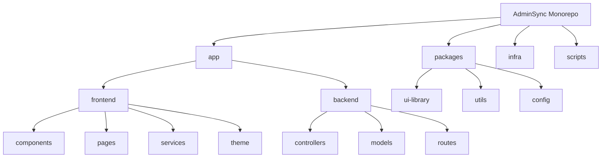
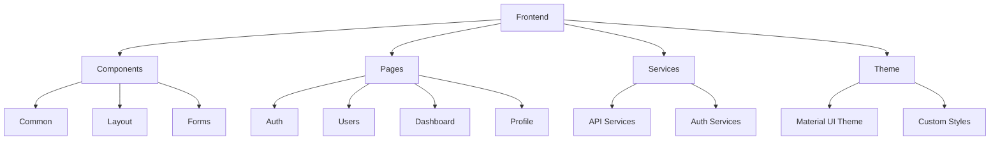
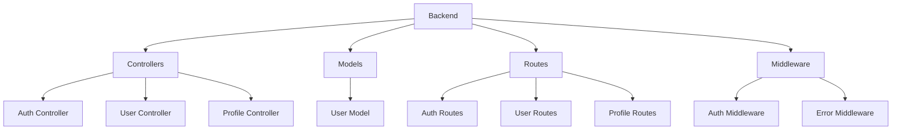
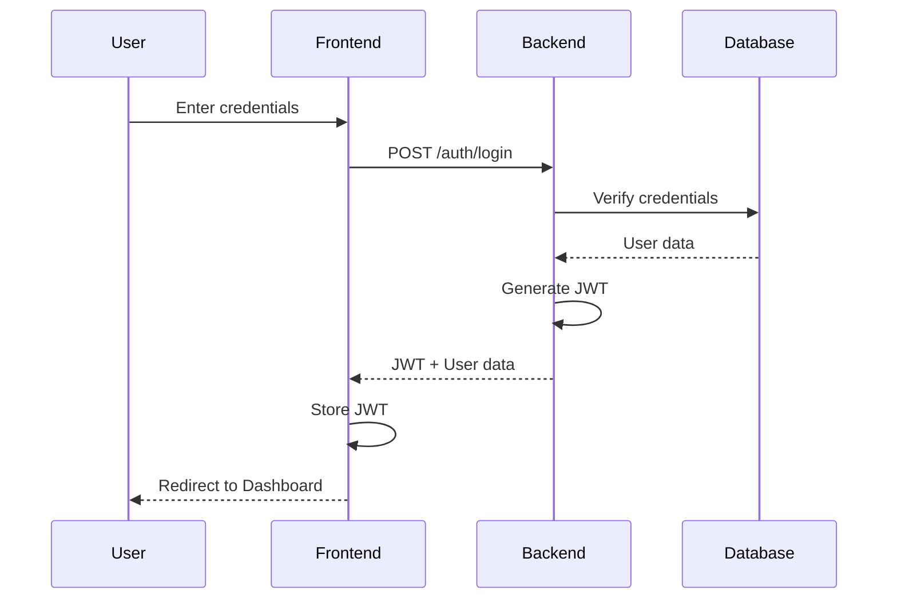
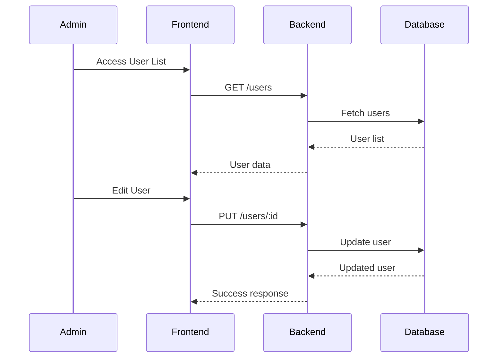
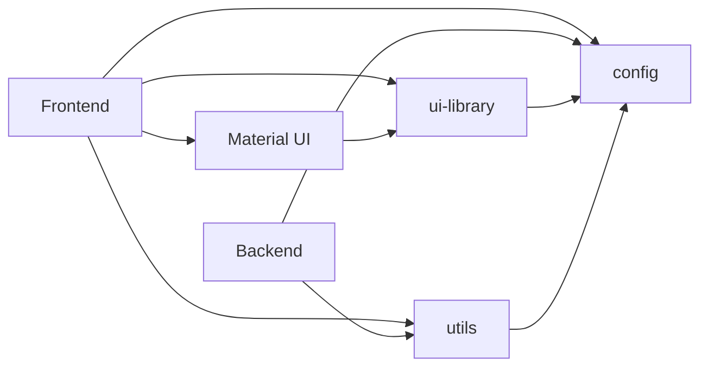
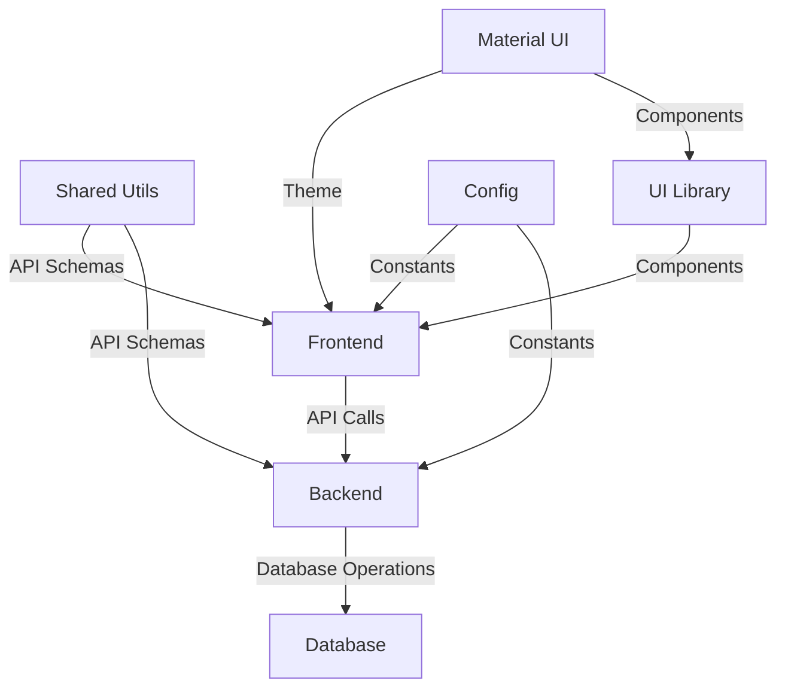
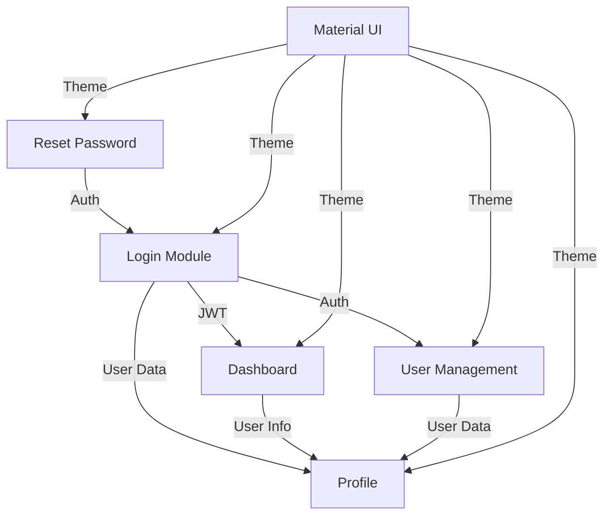
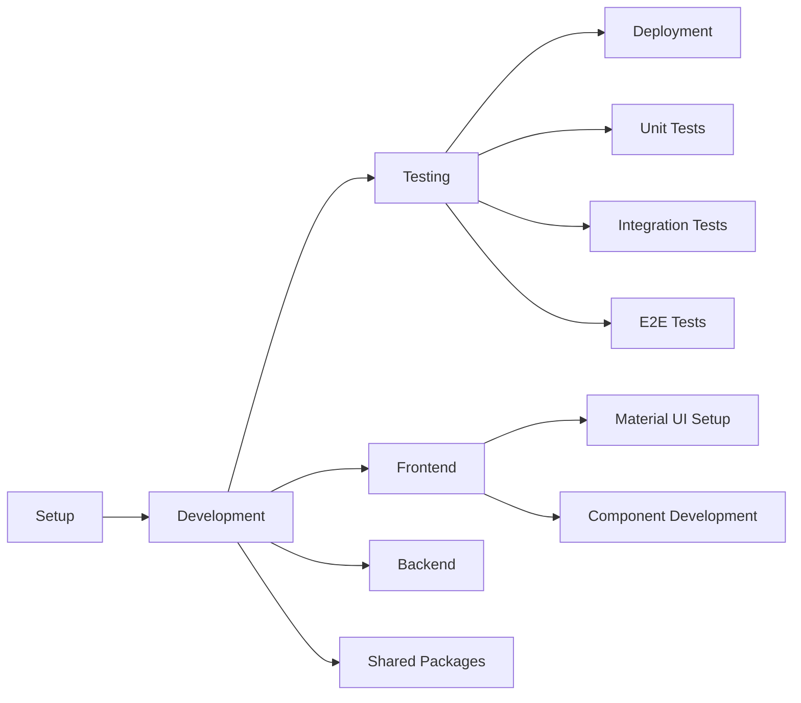
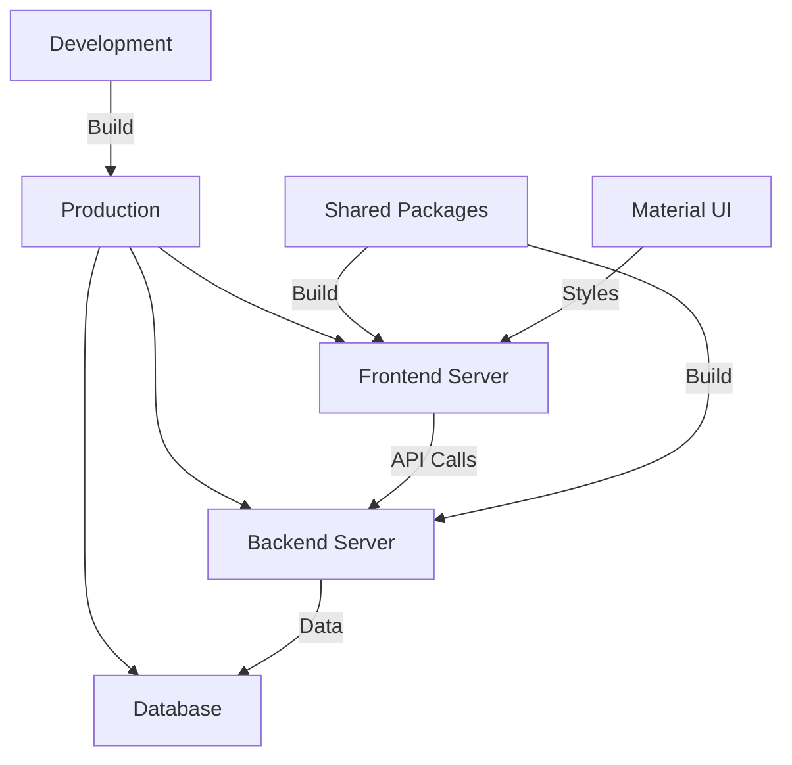

# AdminSync Architecture Diagrams

This document contains visual diagrams representing the AdminSync application architecture.

## 1. Project Structure Overview



## 2. Frontend Component Structure



## 3. Backend Architecture



## 4. Authentication Flow



## 5. User Management Flow



## 6. Shared Packages Integration



## 7. Data Flow Architecture



## 8. Module Dependencies



## 9. Development Workflow



## 10. Deployment Architecture



## 11. CI/CD Deployment Architecture

### Textual Overview

```
┌──────────────┐
│  Developer   │
│  (Git Push)  │
└──────┬───────┘
       │
       ▼
┌────────────────────────────┐
│        GitHub Repo         │
│ (Webhooks: Push/PR Events) │
└──────┬─────────────────────┘
       │
       ▼
┌────────────────────────────┐
│         Jenkins            │
│ (Pipeline on Webhook)      │
│                            │
│ 1. Checkout code           │
│ 2. Install dependencies    │
│ 3. Run tests               │
│ 4. Terraform:              │
│    - Plan/Apply Infra      │
│    - Get ALB DNS outputs   │
│ 5. Build Docker images     │
│    - Backend               │
│    - Frontend (with API URL│
│      from Terraform output)│
│ 6. Push images to registry │
│ 7. Deploy to ECS           │
│ 8. Health checks           │
└──────┬─────────────────────┘
       │
       ▼
┌────────────────────────────┐
│        AWS Cloud           │
│                            │
│ ┌─────────────┐            │
│ │  ECS Fargate │           │
│ │  Cluster     │           │
│ │  (Services)  │           │
│ └─────┬───────┘            │
│       │                    │
│       ▼                    │
│ ┌─────────────┐   ┌─────────────┐
│ │ Frontend    │   │ Backend     │
│ │ Service     │   │ Service     │
│ └─────┬───────┘   └─────┬───────┘
│       │                 │
│       ▼                 ▼
│ ┌─────────────┐   ┌─────────────┐
│ │ ALB (80)    │   │ ALB (3000)  │
│ │ Frontend    │   │ Backend     │
│ └─────┬───────┘   └─────┬───────┘
│       │                 │
│       ▼                 ▼
│   Users (Web)      Frontend → Backend
│                    (API Calls)
└────────────────────────────┘
```

### Mermaid Diagram

```mermaid
graph TD
    Dev[Developer (Git Push)] --> GH[GitHub Repo]
    GH -->|Webhook| Jenkins[Jenkins Pipeline]
    Jenkins -->|Terraform Plan/Apply| AWS[AWS Cloud]
    Jenkins -->|Build & Push Docker Images| AWS
    Jenkins -->|Deploy to ECS| AWS
    AWS --> FE[Frontend Service (ECS Fargate)]
    AWS --> BE[Backend Service (ECS Fargate)]
    FE --> FEALB[Frontend ALB (80)]
    BE --> BEALB[Backend ALB (3000)]
    FEALB --> User[Users (Web)]
    FE -->|API Calls| BEALB
    BEALB --> BE
```

## Notes

1. These diagrams are created using Mermaid syntax and can be rendered on GitHub
2. The diagrams represent different aspects of the application architecture

## How to View

1. These diagrams can be viewed directly on GitHub